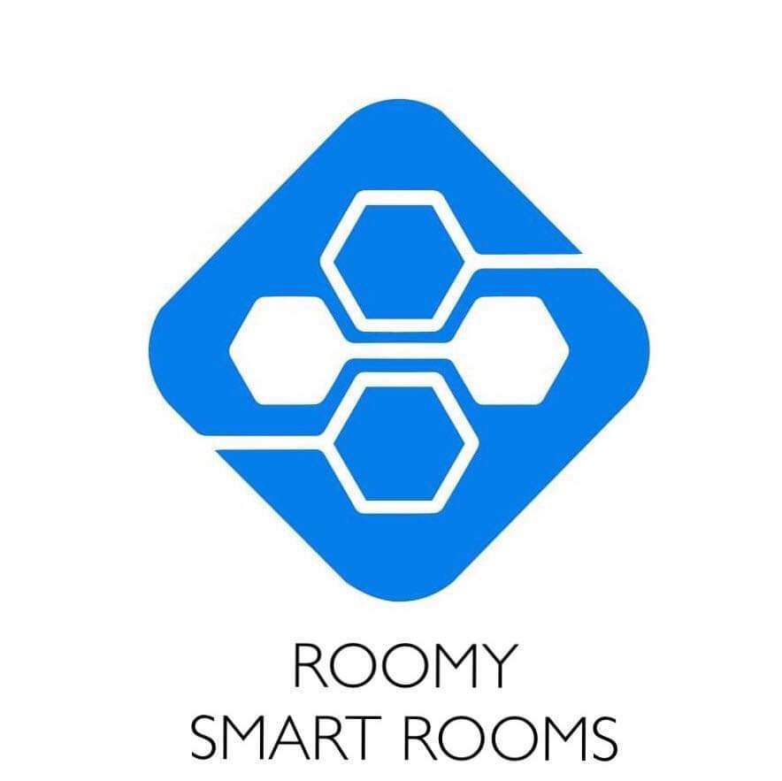

# Home Automation Project

* I worked on designing and developing a complete wireless smart room unit to control home appliances.
* It can also measure the energy used by appliances to monitor if a device is using more power than usual to make that room energy efficient.
* I designed a printed circuit board for my home automation design and tested my design using Proteus simulation.
 

